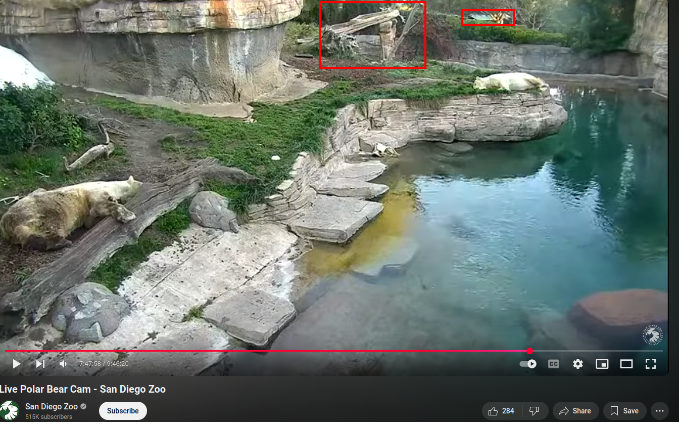

Hey My Friend!  
This is my walkthrough for the OSINT task from Sofia Santos' website.

Task briefing:
The image below is a screenshot from a zoo live cam. It was taken on January 15, 2023 at around 2pm local time.
Please answer the questions below:

a, In which zoo are these polar bears located? 
b, What was the temperature at the time of the screenshot? 
c, What were the exact coordinates of where the bears were lying down?

* * *

##  In which zoo are these polar bears located?
First of all what we can see on the image?
Two bears are laying on the ground. We can see a tree and and interesting stone structure and in the background among the trees there is a light green roof. It seems there is a ditch behind the bears, might have water in it to cool them down.

To find the location of the bears i made a google query like "polar bear zoo cam" and the first finding was the San Diego Zoo.

I clicked and the result was really promising. This zoo has a webcam called "polar cam" which follows the bears during daylight. Altough i did not see the exact location the environment and the type of rocks was pretty similar like in the image from the task.

After that i tried to locate this spot with Google Earth.
We can see on the image below the Polar Bear Plunge in San Diego Zoo. We can see many matches from the orgonal image. We can see the stone structure, the green roofs in the background and the ditch with the water.

But i wanted to be sure i found exactly the right place, so i started diggin a bit more.
At the end i found the zoo's official YouTube channel and they posted a video which shows the LIve Polar Bear Cam.
I took a screenshot and  i could precisely compare the original image and the screenshot from the video and the similarities were clear. Guys, it is that place. We can see the rock structure, the green roof and the ditch really clearly.

We have the answer for the first question:
**San Diego Zoo Polar Bear plunge**

* * *
##  What was the temperature at the time of the screenshot?

This question was pretty easy. I used the www.wunderground.com website and set the exact date.

Below we can see the detailed temperatures during that day and i chose the closest time to the given time from the task.

Answer for the second question:
**63 °F -> 14.4 °C**

* * *
## What were the exact coordinates of where the bears were lying down?

To answer this question we go back to Google Earth and select the place where the bears were laying on the original image and in the top right corner we can see the exact coordinates.

Answer for the third question:
**32°44'03"N 117°09'16"W**