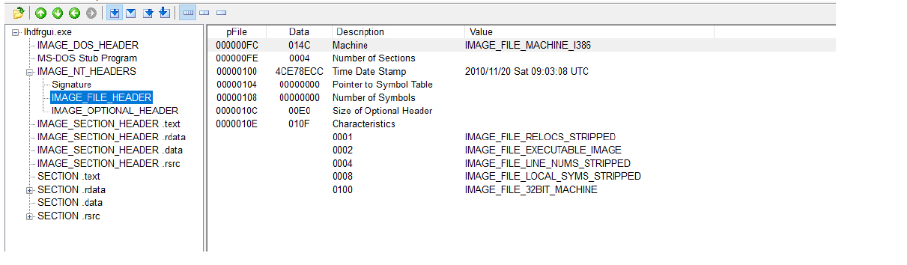
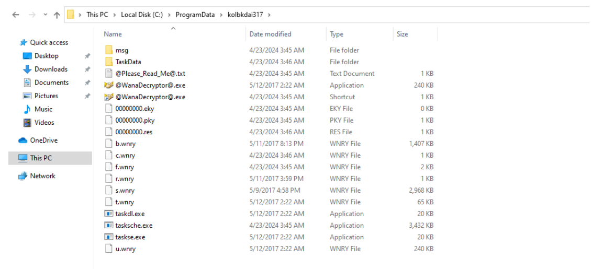
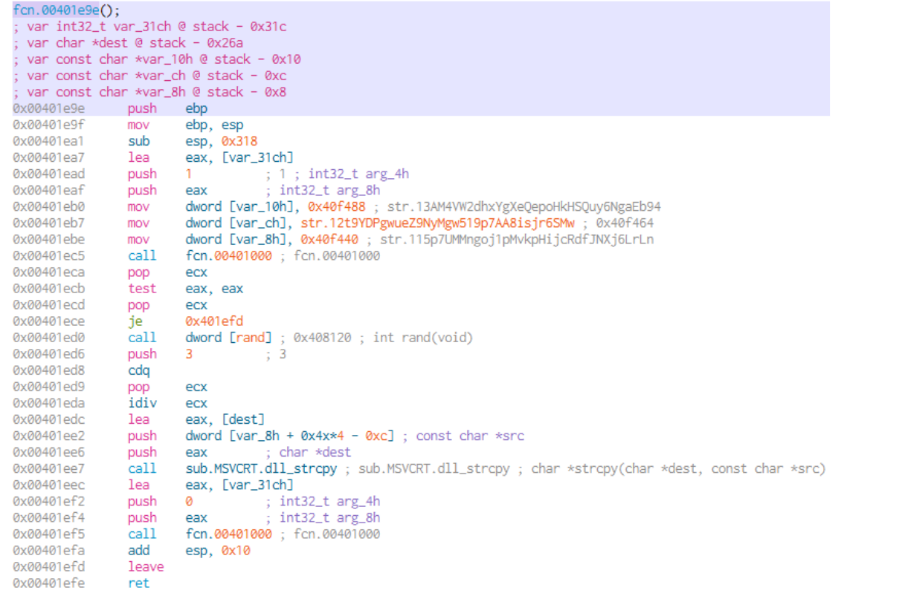

### Overview

The Wannacry ransomware appeared in 2017 and caused serious damage. By analysing the code we can understand the mechanisms of its inner workings and how it spread. This helps us understand why it was so effective. We can gain a deeper knowledge about cyberattacks and how malware utilizes system vulnerabilities.

File name: lhdfrgui.exe 
SHA256: 24d004a104d4d54034dbcffc2a4b19a11f39008a575aa614ea04703480b1022c

## Static analysis
### File analysis using Virustotal
In the first step, I aimed to determine whether we are dealing with malicious code. The best tool for this initial assessment is [VirusTotal](https://www.virustotal.com). I uploaded the file’s hash value, and the results can be seen in the screenshot below:

                             Figure 1. Virustotal analysis

The result is quite clear: 69 out of 73 security vendors flagged the sample as malicious. The most common detection label is **"Trojan.WannaCry/Wanna"**. Several vendors also identified it with labels such as **"ransom"** or **"ransomware"**. Based on this information, it is reasonable to suspect that the sample is a ransomware variant.
### File analysis using PEView tool
In the second step i analysed the structure of the file by using PEView. The structire can be seen in the screenshot below. 

                             Figure 2. File structure

The PE (Portable Executable) is a file format used by the windows operating system. It helps to handle the executables és the belonging dynamic libraries for the oprating system.
The IMAGE_DOS_HEADER and the MS-DOS Stub Program do not contain much information for us.  The IMAGE_NT_HEADER and the IMAGE_FILE_HEADER shows basic informations such as the timestamp. This is crucial becasue we can see when the program was compiled, so we have information how old the executable is.

                                Figure 3. File structure

The IMAGE_OPTIONAL_HEADER also contains relevant information. The "subsystem" field indicates whether the software has a graphical interface (GUI) or console interface.

                                 Figure 4. File structure

The `IMAGE_SECTION_HEADER` entries—such as .text,.rdata , .data, and  .rsrc—provide crucial details about the structure of the executable. By comparing the **Virtual Size** and the **Size of Raw Data**, we can determine whether the software is likely packed. The **Virtual Size** represents the amount of memory the section occupies when the executable is loaded, while the **Size of Raw Data** indicates the amount of space it takes on disk. If these values are similar, it's likely the executable is not packed. However, significant differences between them may suggest that the executable is packed.

                                Figure 5. File strucutre

The next section provides information about each segment. The compiler assigns the names of these segments.

- .text: Contains the instructions executed by the CPU.
- .rdata: Read-only data segment.
- .data: Segment for initialized data.
- .rsrc: Stores resources such as icons and cursor shapes.

The **Import Address Table (IAT)** is typically located in the `.rdata` segment and lists all functions imported by the executable. In the screenshot below, all the functions used by the executable can be seen.

                             Figure 6. Import Address Table

### Suspicious strings, searching for API calls
In the third step i was searching for suspicious indicators such as strings, API calls which can help me in the dynamic analysis.
I used a command-line tool called **floss** to search for strings.  
The following strings caught my attention and may be useful for further analysis:
- %s -m security.
- \\192.168.56.20\\IPC$.
- C:\%s\qeriuwjhrf.
- tasksche.exe.
- icacls. /grant Everyone: F: F /T /C /Q.
- WNcry@2ol7.
- WanaCrypt0r.
- http[:]//www.iuqerfsodp9ifjaposdfjhgosurijfaewrwergwea[.]com.

A tool called **PEStudio** provides a feature that flags potentially suspicious API calls.  
Based on the results, I identified several interesting functions such as **InternetOpenA** and **InternetOpenUrl**, which are typically associated with network communication.  
Additionally, API calls like **CryptGenRandom** and **CryptAcquireContextA** may indicate the presence of cryptographic operations often leveraged by ransomware.

### Analysing the sample using PEiD
Using PEiD, we can determine whether the file is packed or not.
In the screenshot below, **Microsoft Visual C++ 6.0** is detected as the compiler, which indicates that the sample is likely unpacked.  
Additionally, the tool provides further details about **memory addresses** and **section segments**.

                              Figure 7. PEiD analysis
## Dynamic analysis
During the dynamic analysis i executed the sample and investigated the network activity of the executable. In addition, I examined the changes it made to the file system and the Windows registry.
The analysis was conducted on a virtual machine. First, I created a snapshot to allow a return to the base state of the machine if needed. For executing the sample, I used two virtual machines: one running Windows-based FLARE VM, and the other running Linux-based REMnux. I used REMnux to simulate internet services and to monitor network activity using Wireshark. File system and registry changes were examined on FLARE VM using Process Monitor.

At the first execution i did not notice any sign of changes. I examined the result of wireshark and i noticed  that the code started a network traffic.. In the screenshow below is seen that there is a DNS request to resolve http[:]//www.iuqerfsodp9ifjaposdfjhgosurijfaewrwergwea[.]com
After that there is a three-way handshake and the code tried to make a GET request toward the website.

                          Figure 8. Analysing of network activity

Upon initial execution, I did not observe any immediate signs of system changes. However, analysis of the Wireshark capture revealed that the sample initiated network communication. As shown in the screenshot below, a DNS request was made to resolve the domain **http[:]//www.iuqerfsodp9ifjaposdfjhgosurijfaewrwergwea[.]com**. 
Following the DNS resolution, a TCP three-way handshake was established, and the sample attempted to issue an HTTP GET request to the resolved IP address.

I did not observe any malicious activity on FLARE VM during the initial execution. Therefore, I disabled the internet simulator and re-executed the sample. Following the second execution, an image was displayed on the screen, as shown in the screenshot below.

                        Figure 9. Wannacry ransom window
                        
Additionally, I observed that the file extensions on the system had been modified to .WNRCY, indicating potential ransomware behavior.

### Dynamic analysis using Process Monitor
By analyzing the events in Process Monitor, it can be observed— as shown in Figures 10 and 11 — that a file named **tasksche.exe** was created in the **C:\Windows** directory.
By filtering for the process ID of `tasksche.exe`, it can be observed that the newly created executable generates a folder named **kolbkdai317** in the **C:\ProgramData** directory. Additionally, several files with the `.wnry` extension are created.

               Figure 10. Examining the created files using Processs Monitor
               

             Figure 11. Examining the created files using Processs Monitor

Upon inspecting the contents of the folder, these newly generated files and subdirectories become visible.

                    Figure 12. The created files and folders

==**b.wnry:**==
- It contains the background image that was generated and set by the malware following system infection.
- Hash value: d5e0e8694ddc0548d8e6b87c83d50f4ab85c1dadb106d6a6a794c3e746f4fa.

                          Figure 13. Contents of the **b.wnry** file

==c. wnry:==
- Contains text files and TOR doamin addresses.
- Hash value: 055c7760512c98c8d51e4427227fe2a7ea3b34ee63178fe78631fa8aa6d15622.

==r. wnry:==
- A text file with various types of information.
- Hash value: 402751fa49e0cb68fe052cb3db87b05e71c1d950984d339940cf6b29409f2a7c.

                         Figure 14. Contents of the **r.wnry** file

==s. wnry:==
- Contains the necessary files for executing the TOR software.
- Hash value: e18fdd912dfe5b45776e68d578c3af3547886cf1353d7086c8bee037436dff4b.

                          Figure 15. Contents of the **s.wnry** file

==t. wnry:==
- It contains hexadecimal data.
- Hash value: 97ebce49b14c46bebc9ec2448d00e1e397123b256e2be9eba5140688e7bc0ae6.

==u. wnry:==
- It is an executable.
- Hash value: b9c5d4339809e0ad9a00d4d3dd26fdf44a32819a54abf846bb9b560d81391c25.

                        Figure 16. Contents of the **u.wnry** file

==taskdl.exe:==
- It is an executable.
- Hash value: 4a468603fdcb7a2eb5770705898cf9ef37aade532a7964642ecd705a74794b79.

                              Figure 17. Analysis of taskdl.exe

==taskse.exe:==
- It is an executable
- Hash value: 2ca2d550e603d74dedda03156023135b38da3630cb014e3d00b1263358c5f00d

                               Figure 18. Analysis of taskse.exe

==tasksche.exe:==
- It is an executable file.
- Hash: ed01ebfbc9eb5bbea545af4d01bf5f1071661840480439c6e5babe8e080e41aa

                         Figure 19. Analysis of tasksche.exe

==@WanaDecryptor@.exe:==
- It displays information related to paying and decoding.
- Hash value: b9c5d4339809e0ad9a00d4d3dd26fdf44a32819a54abf846bb9b560d81391c25.

==@Please_Read_Me@.txt:==
- Text file.
- Hash value: b9c5d4339809e0ad9a00d4d3dd26fdf44a32819a54abf846bb9b560d81391c25

The c.wnry file contains the following tor domains:
- gx7ekbenv2riucmf.onion;
- 57g7spgrzlojinas.onion;
- xxlvbrloxvriy2c5.onion;
- 76jdd2ir2embyv47.onion;
- cwwnhwhlz52maqm7.onion
- https://dist.torproject.org/torbrowser/6.5.1/tor-win32-0.2.9.10.zip

The **msg** folder contains instructions in different languages.

                           Figure 20. Contents of the **msg** folder

By examining the running processes, I observed that the malicious code establishes persistence on the system by creating the following registry key and value:
- HKLM\SOFTWARE\WOW6432Node\Microsoft\Windows\CurrentVersion\Run\kolbkdai317 Value: "C:\ProgramData\kolbkdai317\tasksche.exe"

                           Figure 21. Establishing persistence

### Analysing the malware's propagation using TCPView
By examining the malware's activity using TCPView, I observed— as shown in the screenshot below — that the code scans the internal network of the victim machine and attempts to establish connections on port 445. Port 445 is used by the Windows file sharing protocol known as SMB (Server Message Block). The malware leverages this protocol in an attempt to propagate laterally within the internal network.

                                Figure 22. TCPView

## Code Analysis
Code analysis plays a crucial role in malware analysis, as it provides the clearest understanding of the malware’s behavior. It allows us to precisely determine how the code operates, including which specific functions it executes and in what order.

In the first step, the code invokes the **InternetOpenA** function, which resides in the wininet.dll library and is responsible for initializing internet communication. This function is typically used by applications to establish a network session.
Next, it passes the previously observed URL as a parameter to the **InternetOpenUrlA** function, also located in wininet.dll. This function allows applications to access and retrieve content from the specified URL.
Finally, the **InternetCloseHandle** function is called to close the resources associated with the session. If the URL is successfully opened, the program terminates; otherwise, it continues its execution.

                        Figure 23. Accessing the URL

In the second stage, the program calls the **GetModuleFileNameA** function, which is used to retrieve the full path of the executable file associated with a given module.
Next, the program checks whether there are fewer than two command-line arguments. If so, it proceeds with the installation process by invoking the **arg_kezelo** function. 

                               Figure 24. Arguments handling

The **mssevcsvc2.0_service** function first invokes the **OpenSCManagerA** API function. This function establishes a connection to the Service Manager. Subsequently, it creates the **mssecsvc2.0** service using the **CreateServiceA** function, with the display name 'Microsoft Security Center 2.0 Service', and then starts it via the **StartServiceA** function. This process is illustrated in Figure 25.

                  Figure 25. Starting the **mssecsvc2.0** service

By analyzing the original sample using CFF Explorer, I identified a resource with the ID 1831. The code locates this resource using the **FindResourceA** API, and subsequently loads it into memory. After loading, **tasksche.exe** is written to the **C:\Windows** directory. The extracted resource is then written into the **tasksche.exe** file, as demonstrated in the screenshots below.

                            Figure 26. Locating the resource

                    Figure 27. tasksche.exe is written to C:\Windows folder

                            Figure 28. CFF Explorer

I extracted the resource from the original file using wrestool. I created a file named 1831.bin with the following command:
- wrestool –name=1831 -R -x wannacry > 1831.bin

By analysing the file using Cutter i observed several crucial information about the code. 
As shown in Figure 29, the software generates a random character string based on the computer name, which becomes the name of a hidden folder in the **C:\ProgramData** directory (in this case, **kolbkdai317**). It copies the **tasksche.exe** file into this folder, then extracts and writes the directories and files visible in Figure 11. Subsequently, it sets the folder's attributes to hidden using the **attrib +h** command. 
Finally, the program grants full access to the folder and all subdirectories for all users with the following command: 
- icacls . /grant Everyone:(F) /T /C /Q.

                       Figure 29. Generating random character string

                      Figure 30. Creating ProgramData folder

                          Figure 31. Copying tasksche.exe executable

                          Figure 32. Setting Folder Attributes and Permissions

The malware encrypts files on the infected device and executes the @WanaDecryptor.exe process, which presents information to the user such as Bitcoin wallet addresses, ransom amounts, and payment deadlines. As shown in the screenshot below, the malware contains hardcoded Bitcoin addresses; one of these addresses is selected and displayed to the user for payment.

                           Figure 33. Hardcoded Bitcoin addresses