## Sample

SHA256: 50b5eb20f116100571a794e5fe30953bced95340d1a180108806cfe9e04da768

* * *

## Background

Agent Tesla is an advanced remote access trojan (RAT) designed for stealing and infiltrating sensitive information from infected machines. It is capable of collecting various types of data, including keystrokes and login credentials stored in web browsers (such as Google Chrome and Mozilla Firefox) and email clients.

First appearing in 2014, Agent Tesla has undergone multiple iterations, with numerous variants being deployed. The malware employs various evasion techniques to hinder detection and complicate analysis. It is primarily distributed via phishing emails.

* * *

## Basic Static analysis

To begin the analysis, I used Detect It Easy to gather fundamental information about the malware, such as file hashes and the programming language used. This malware is written in C#.

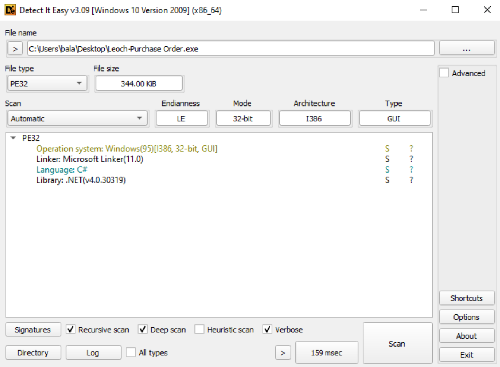

Next, I analyzed the file using VirusTotal to determine its malware family and the number of detections across different antivirus engines.

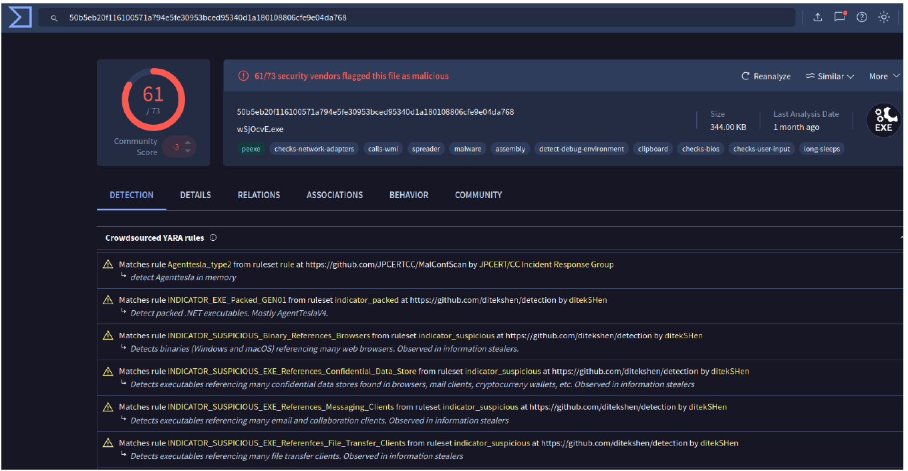

* * *

## Basic Dynamic analysis

For dynamic analysis, I utilized Process Monitor to observe the malware’s behavior during execution. As shown in the screenshots below, the malware attempts to steal various credentials and exfiltrate browser data.

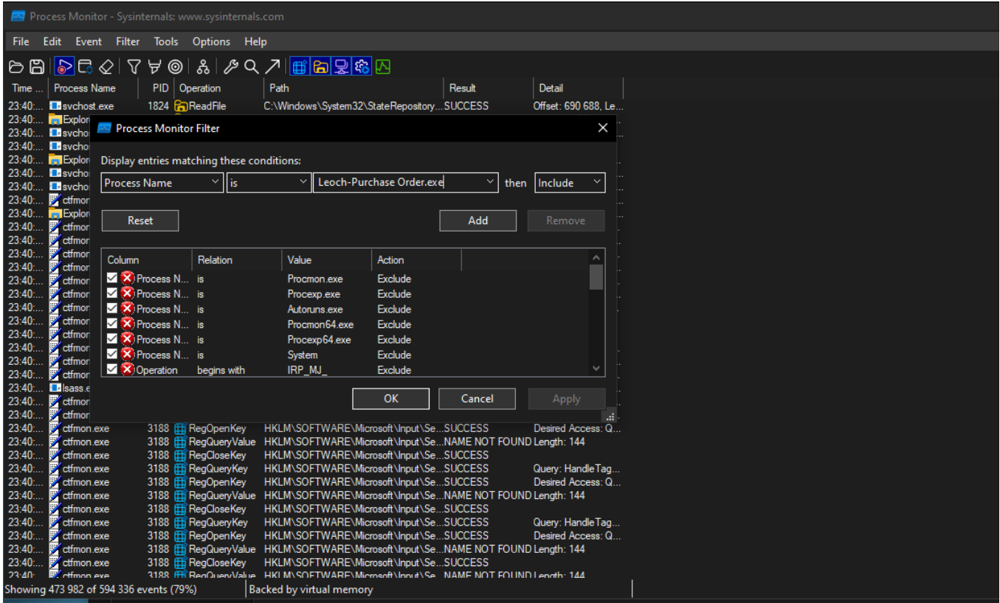

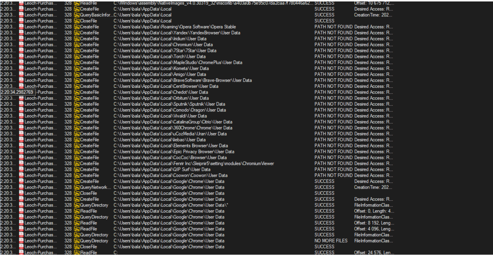

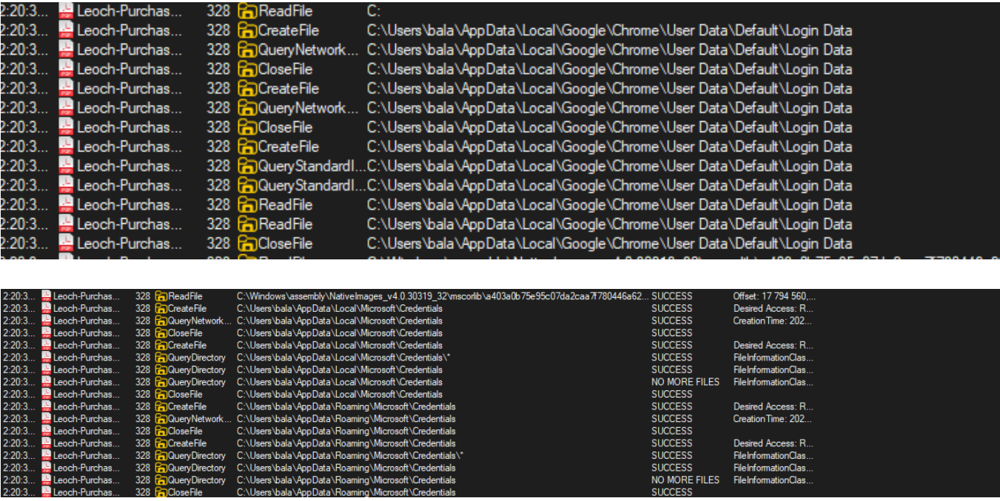

* * *

## Advanced dynamic analysis

Using dnSpy, I identified the malware’s unpacking function. By setting breakpoints and executing the malware within dnSpy, I was able to extract the unpacked content for further examination.

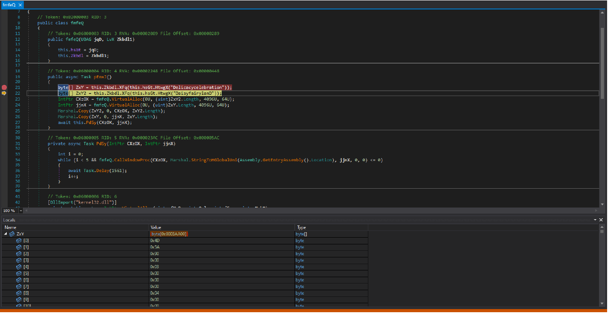

Upon analyzing the second-stage payload in dnSpy, I confirmed the malware's core functionalities, which include:
	- Keylogging
	- Screen logging
	- Password harvesting
	- Data extraction from browsers and databases

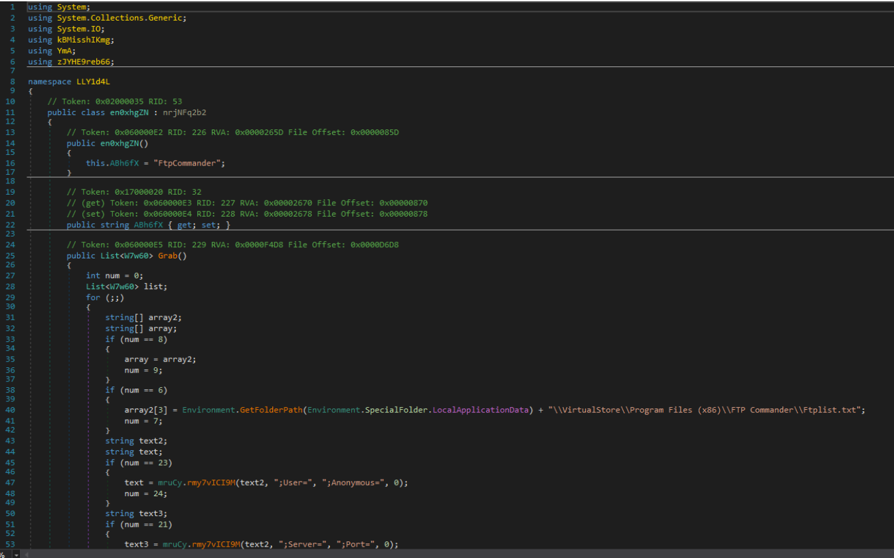

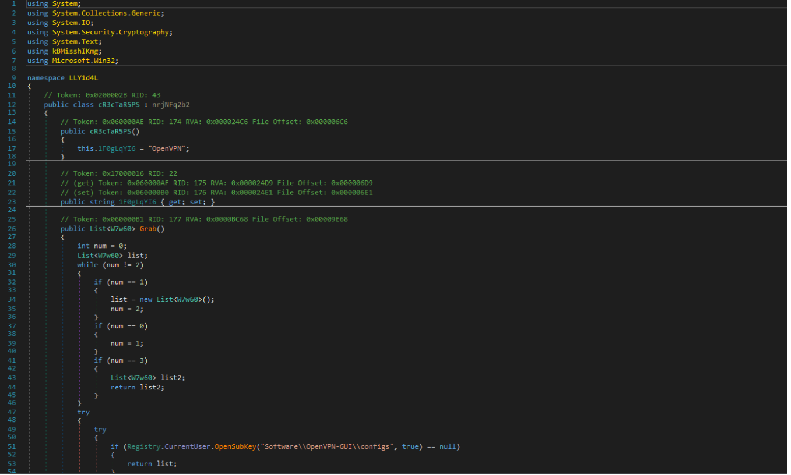

Extracted C2 informations: 

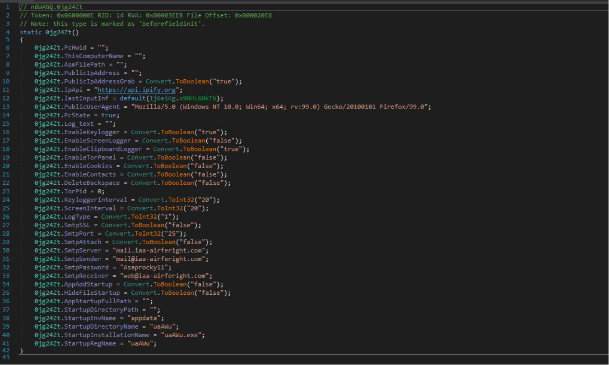

* * *

## Obtaining the unpacked sample using Pe-Sieve

I utilized PE-Sieve to obtain the unpacked sample for code analysis. The process involved:
	1. Identifying the process ID of the child process. (476)
	2. Running PE-Sieve on the identified process.

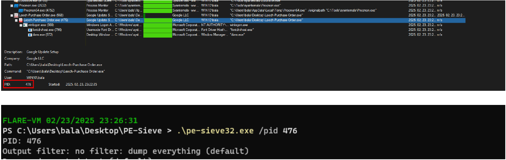  

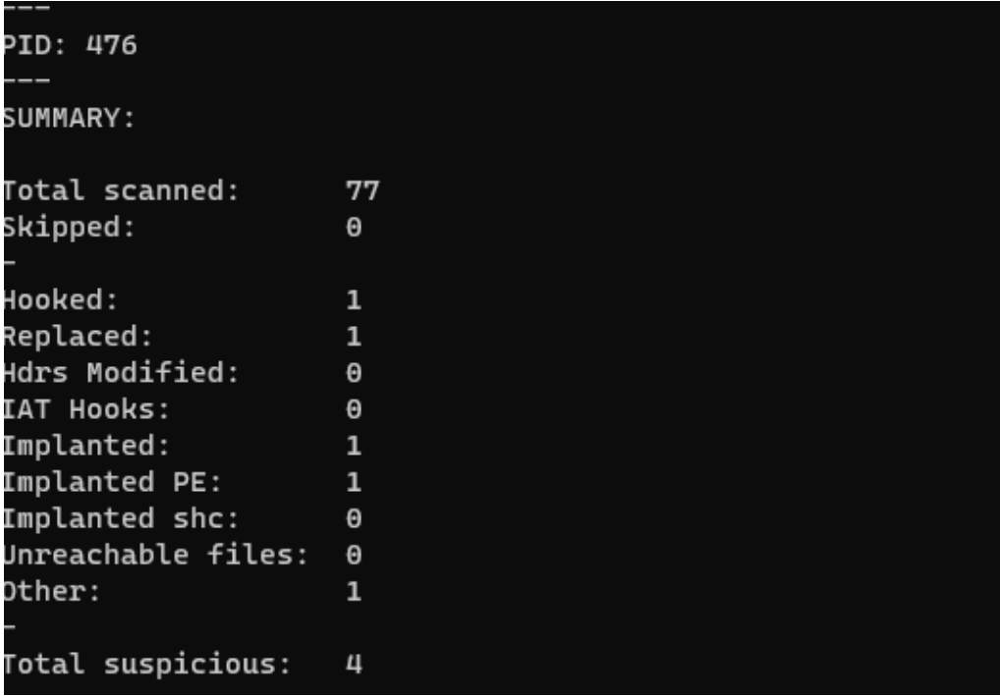

As shown in the screenshots below, the extracted second-stage payload is named 400000.Leoch-Purchase Order.exe.

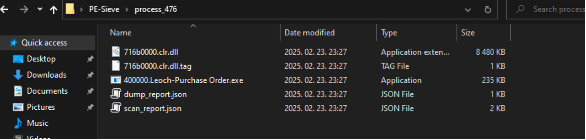

* * *

## IOCs

### Hashes
50b5eb20f116100571a794e5fe30953bced95340d1a180108806cfe9e04da768  
3109297f390a7b155a8b99fc71ba270211899a2cfbed9290c7a475a6c549bbc6

### SMTP server:
mail.iaa-airferight.com

### SMTP password
Asaprocky11

### SMTP sender
mail@iaa-airferight.com