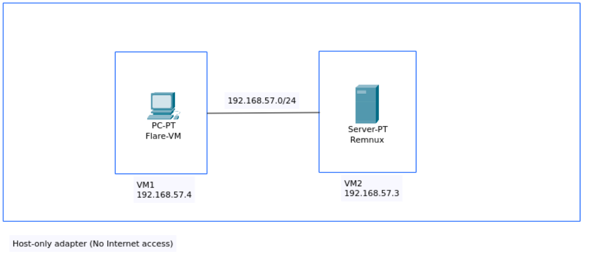
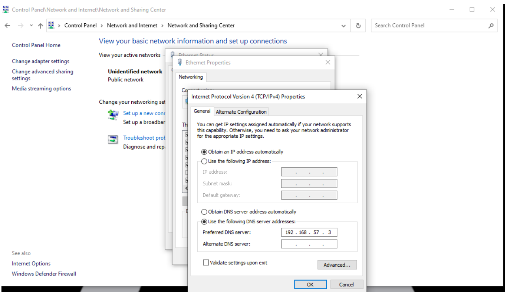
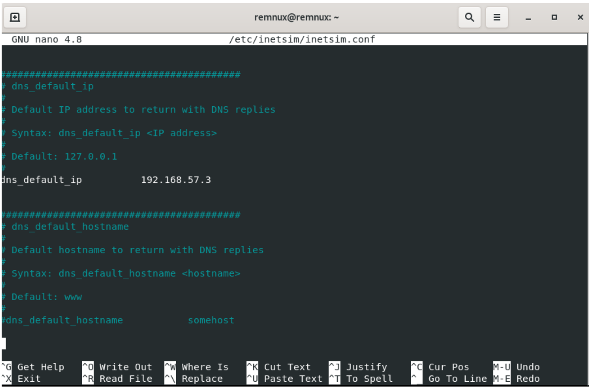
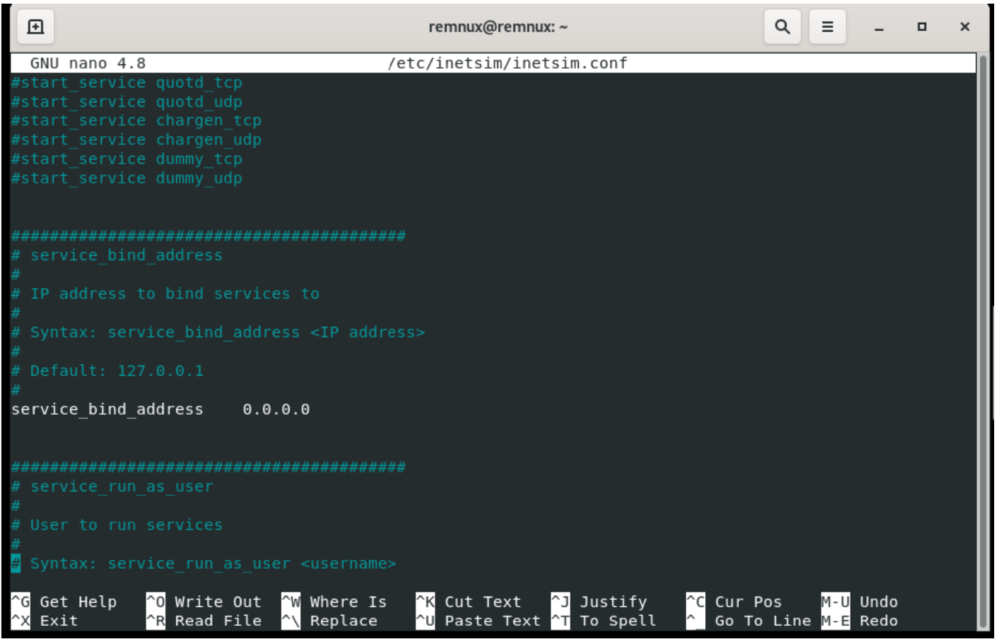
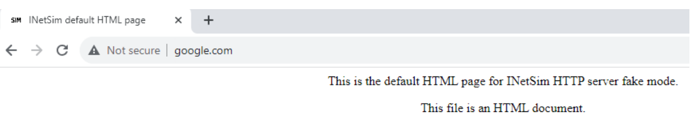
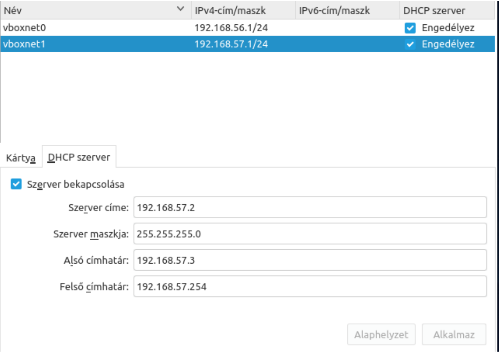
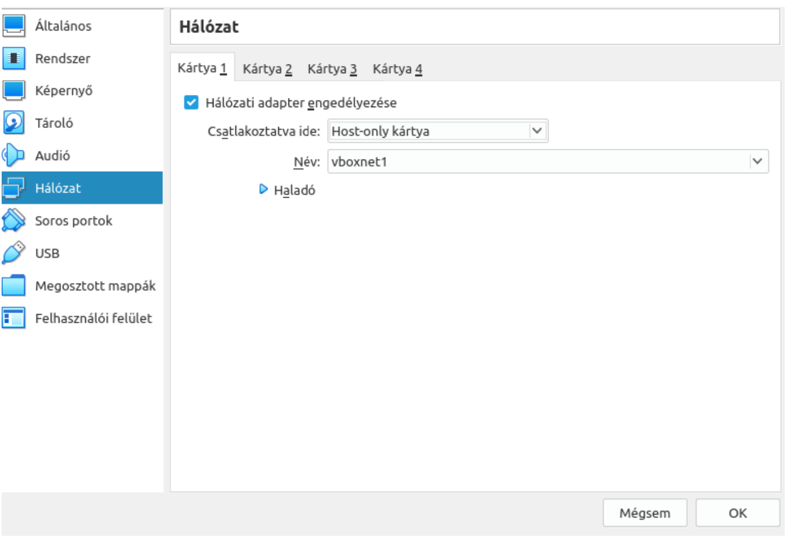
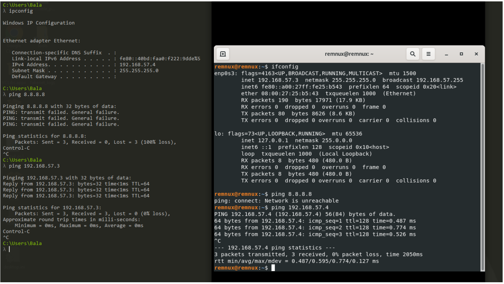

## Introduction
Malware analysis requires a controlled and secure environment in which malicious code can be executed, observed, and studied without risk to production systems. To achieve this, analysts rely on isolated environments such as virtual machines, sandboxes, and air-gapped computers. These setups ensure that the malware’s behavior can be examined safely, while preventing unintended communication with the host system or the internet.

This article focuses on building a malware analysis environment using VirtualBox, demonstrating how to configure isolated networks, enforce host protection, and enable controlled interaction between virtual machines. Step by step, i will show how to restrict internet access, guarantee host isolation, and at the same time allow internal communication between guest systems for realistic testing scenarios.

### Sandbox
Sandboxes are controlled software environments designed to safely execute and analyze potentially malicious code. By running malware inside a sandbox, analysts can observe its behavior, system modifications, and network activity without risking the host or production environment.

**Advantages:**
- Easy to deploy and operate
- Cost-effective compared to full virtualized labs

**Disadvantages:**
- Many modern malware families implement anti-sandbox or anti-VM techniques (evasion methods). In such cases, the malware may alter its behavior, remain dormant, or terminate execution to avoid detection.

Many endpoint protection platforms (EPP) and endpoint detection and response (EDR) solutions now integrate sandboxing capabilities. Suspicious executables and files can be detonated in these environments before being allowed to run on a production endpoint. However, sandboxes should not be considered a complete security solution. They must be complemented with multi-layered defenses, including behavioral detection, threat intelligence, memory analysis, and network monitoring, to effectively defend against advanced persistent threats (APTs) and highly evasive malware.

### Air-gapped Computer
Air-gapped computers are isolated systems that are physically disconnected from the internet and any other networks.

**Advantages:**
- Provide a genuine execution environment with direct interaction on real hardware, allowing analysts to observe the malware’s true behavior without virtualization artifacts.

**Disadvantages:**
- Network-based activity (e.g., command-and-control communication, data exfiltration attempts) cannot be directly monitored.
- Higher setup and maintenance costs compared to virtualized or sandboxed environments.

### Virtual machines
Virtualization is a technology that allows us to create a virtualized software environment on top of a host system. 
We can allocate varying amounts of CPU, memory, and storage to the virtual machine (VM).  
These resources are borrowed from the underlying physical host, which can be a personal computer or a server managed by a cloud service provider.

**Advantages**
- Lower setup and maintenance costs
- Ability to create snapshots and roll back to a previous state
- Enables analysis of the full scope of a malware’s activity (network, file system, and system modifications)

**Disadvantages**
- If the malware implements anti-sandbox or anti-VM techniques, it may alter its behavior, remain dormant, or terminate execution to evade analysis.
- Monitoring network activity typically requires additional software-based solutions (e.g., packet capture or IDS tools).

**Key considerations when creating a virtualized analysis environment:**
- Keep both the virtualization software and host operating system up to date
- Ensure the VM is isolated from the local area network (LAN)
- Avoid attaching external media storage directly to the VM

In the next section, I will demonstrate how to set up a virtualized malware analysis environment using virtual machines.

## Designing the Environment

The environment was set up using Oracle VirtualBox as the virtualization platform. Two virtual machines (VMs) were created for analysis purposes:

- **FLARE-VM**: A Windows 10–based VM with numerous pre-installed analysis tools. It is used to execute malicious samples and monitor host-based indicators, such as file system changes, registry modifications, and process activity.
- **REMnux**: A Linux-based VM specifically designed for malware analysis and reverse engineering. A DNS server was configured on this machine to monitor and analyze the malware’s network behavior.

The screenshot below illustrates the test environment configuration.

                          Figure 1: Environment configuration

### REMnux Configuration

Malicious code often checks for the presence of a network connection before executing. Considering this behavior, it is crucial to use a DNS simulator to provide decoy responses to DNS requests. For this purpose, **INetSim** was deployed.

Figures 2, 3, and 4 illustrate the DNS server configuration. Both **FLARE-VM** and **REMnux** were configured to resolve DNS requests to the REMnux VM’s IP address, ensuring that all network queries from the malware are captured and analyzed without reaching the real network.

                              Figure 2: Flare-VM configuration

                            Figure 3: INetSim configuration

                           Figure 4: INetSim configuration

After completing the setup, Figure 5 illustrates that the DNS simulator successfully responds to client requests.

                        Figure 5: Checking the configuration

All network communications are fully visible and controllable through this setup. A snapshot of the virtual machine was created prior to the analysis, and after completing the examination, the VM was restored to its previous state.

## Network configuration
The main objective is to configure the virtual machines so that they can communicate with each other, while remaining isolated from the host system and without any direct connection to the internet.
VirtualBox allows the creation of an isolated network, where the virtual machines can be securely configured. This setup helps protect the host system because the guest machines operate on a separate, segmented network.
In the screenshot below, a network named **“Vboxnet1”** is shown with the subnet mask **192.168.57.0/24**. A built-in DHCP server dynamically assigns IP addresses to the virtual machines within the specified range.
On both virtual machines, the network adapter must be set to **“Host-only Adapter”** mode, and the appropriate virtual network must be selected. This ensures proper network isolation between the virtual machines and the host system.
Figures 6, 7, and 8 demonstrate that after completing the setup and starting the virtual machines, they are placed on a separate network and are assigned proper IP addresses. The results of the **ping** command clearly show that the virtual machines cannot connect to the internet, but they can successfully communicate with each other.

                               Figure 6: Isolated network setup

                          Figure 7: Network configuration

                       Figure 8: Network check

## **Conclusion:**  
Creating an isolated malware analysis environment is essential for studying malicious code without exposing the host system or external networks to risk. By properly configuring virtual machines analysts can safely observe malware behavior, network activity, and system modifications in a controlled setting.
While virtualization platforms such as VirtualBox provide flexibility and ease of deployment, it is important to remember that no single environment is perfect. Each setup—whether virtualized, sandboxed, or fully air-gapped—comes with trade-offs in realism, monitoring capability, and cost. Therefore, selecting the appropriate environment depends on the analysis objectives and the resources available.
Ultimately, a well-designed malware analysis lab enables security professionals to gain valuable insights into attacker techniques, improve defensive measures, and strengthen overall cyber resilience.