The three files shown in the screenshot were identified during a research, and I will perform a detailed analysis on them to determine their nature and potential functionality.
### Examined files:

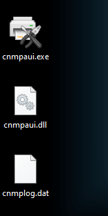
### Static Analysis

As an initial step, I conducted a static analysis on the investigated samples. I examined the files using Detect IT Easy (DIE) and verified the hashes using Virustotal. The file cnmpaui.dll appears particularly dangerous flags it with indicators such as "Korplug" and "DLL hijacker". 49 out of 68 security vendors classified the file as malicious.

**CNMPAUI.EXE** - Hash: 4ed76fa68ef9e1a7705a849d47b3d9dcdf969e332bd5bcb68138579c288a16d3

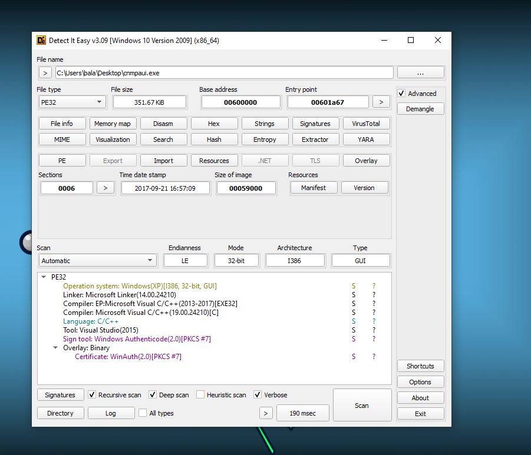

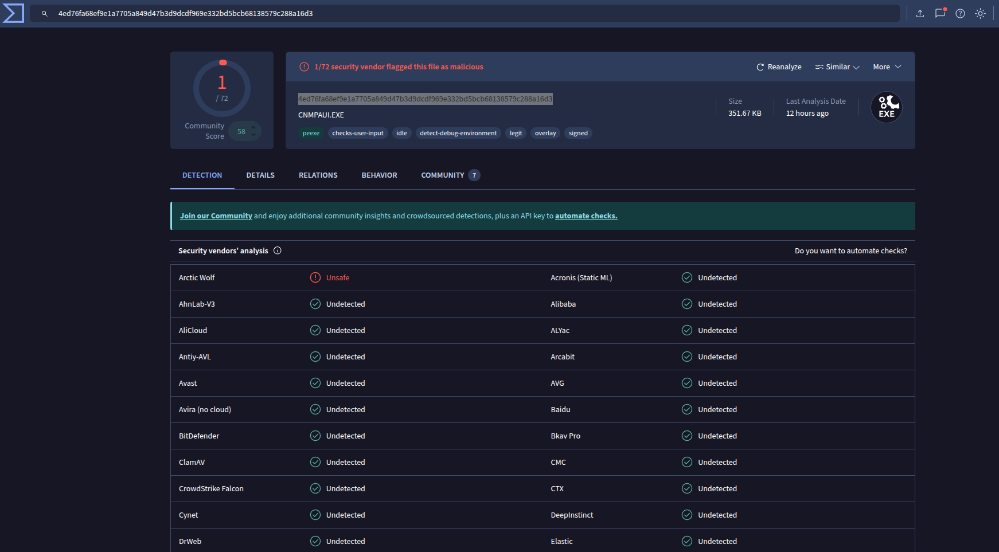

**cnmpaui.dll** - Hash: e53bc08e60af1a1672a18b242f714486ead62164dda66f32c64ddc11ffe3f0df
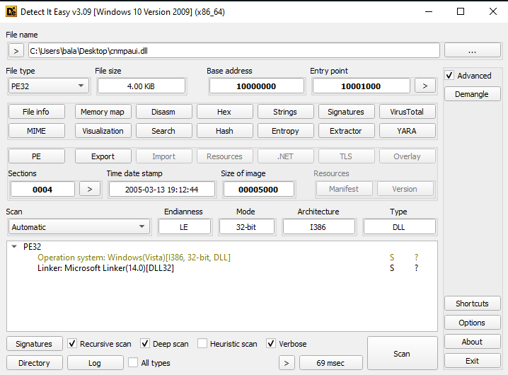

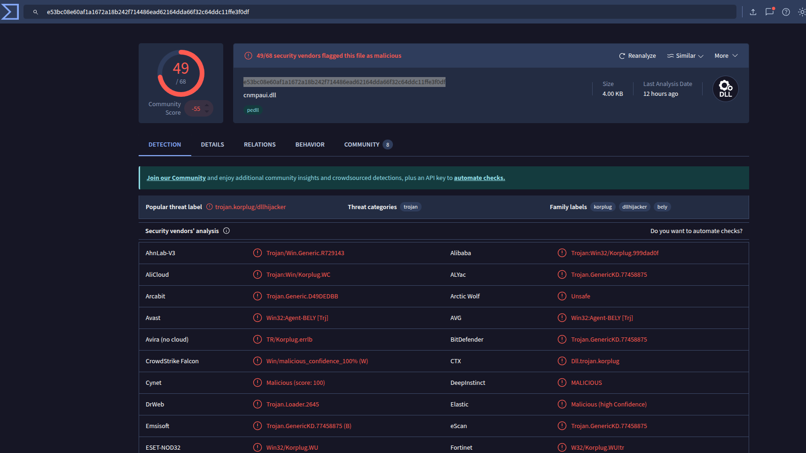

**cnmplog.dat** - Hash: 0f0e1a40095c0c8a508307dd38e4cf15
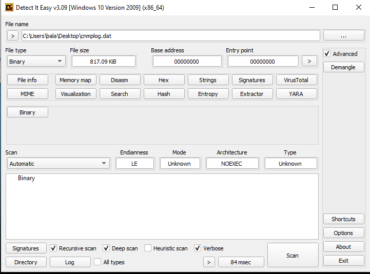

### Dynaimc Analysis
In the second phase, I carried out a dynamic analysis. I executed the binaries and monitored their behavior using Process Explorer and Process Monitor, while capturing network activity with Wireshark. After execution, a PDF document was displayed—likely serving as a decoy—while multiple suspicious activities were observed running in the background.

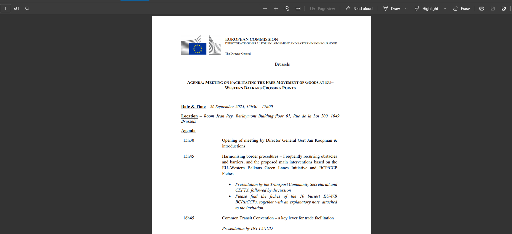

At the first glance we can observe that a new process named cnmpaui.exe was initiated. 

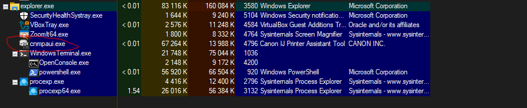

#### Persistence:
The malware establishes persistence by creating a registry entry named _CanonPrinter_ under the Software\Microsoft\Windows\CurrentVersion\Run registry key, pointing to the relocated cnmpaui.exe file. It also creates a hidden directory called SecurityScan and copies its components into this folder.

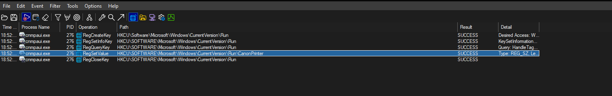
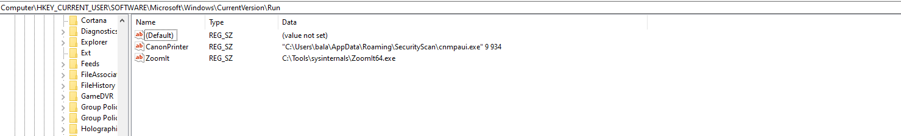

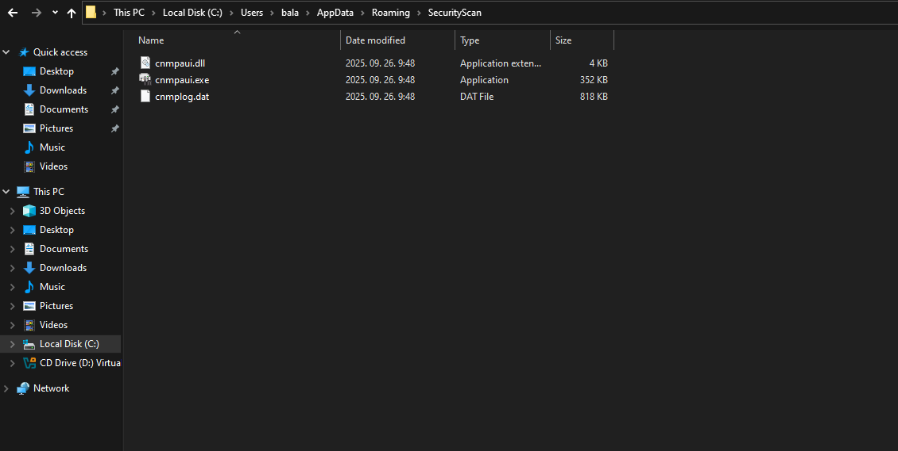

#### Network activity
The capture file contains a suspicious domain: racineupci[.]org which may serve as a C2 domain.

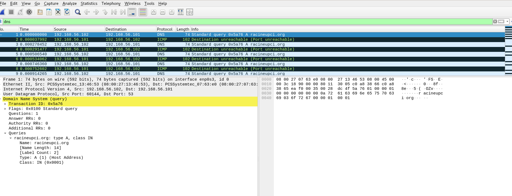
A quick lookup on Virustotal shows that 17 out of 98 security vendors has flagged this domain as malicious.

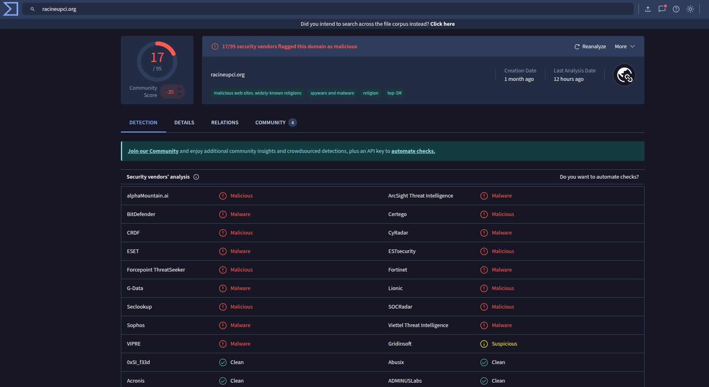

During further research on VirusTotal, I found a report by Arctic Wolf that referenced this domain. After cross-correlating the information with additional IOCs, it became clear that the report was describing the same sample I was analyzing. According to the publication, the malware is identified as PlugX. A China-affiliated threat actor, UNC6384, is known to deploy this malware in cyber-espionage campaigns targeting diplomatic entities in Hungary and Belgium.”

Article: https://arcticwolf.com/resources/blog/unc6384-weaponizes-zdi-can-25373-vulnerability-to-deploy-plugx/