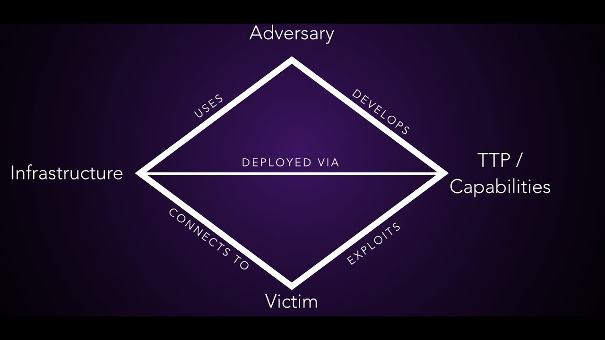

### Phile 6. The Diamond Model

 Diamond Model is a framework for analyzing intrusions by mapping the relationships between four core elements: **Adversary, Capability, Infrastructure, and Victim**.

 

- **Adversary** → who is behind the attack.
- **Capability** → the tools, malware, or exploits used.
- **Infrastructure** → the network resources and systems attackers leverage (e.g., C2 servers, phishing domains).
- **Victim** → the target organization or sector.

By connecting these elements, it becomes easier to understand the context of an intrusion. For example:

- A phishing email (Infrastructure) delivers a remote access trojan (Capability), linked to a known ransomware group (Adversary), targeting healthcare providers (Victim).

This structured approach helps to attribute campaigns, identify patterns, and share findings consistently with other teams.

---

**Adversary**

This element answers the question: who is the attacker?
The attack can be carried out by a nation-state actor, a script kiddie, a cybercriminal, or a hacktivist. In reality, defining the exact threat actor is often difficult. Nation-states frequently use proxy groups, while cybercriminals rely on affiliate models. As a result, the line between cybercrime and espionage is increasingly blurred.

---

**Capability**

Capability refers to the tactics, techniques, and procedures (TTPs) used during an intrusion. It represents the software, tools, and methods an attacker employs. These indicators are extremely valuable, which is why identifying and understanding them is a critical task for analysts.

---

**Infrastructure**

An adversary deploys their capabilities using infrastructure. This may include domains, IP addresses, C2 servers, or email addresses. As discussed in previous chapters, infrastructure is relatively easy to change and often has limited long-term impact when blocked alone. However, analysts should not underestimate its importance—mapping infrastructure can reveal relationships, campaign scope, and attacker intent.

---

**Victim**

The victim is the recipient of capabilities deployed across infrastructure by the adversary. Victims can be individuals, organizations, or entire sectors. It is also important to determine who the actual victim is, as secondary or indirect victims may appear during an intrusion.

---

The Diamond Model is useful across several areas of cyber operations, including threat hunting, incident response, cyber threat intelligence, and threat modeling.

On the other hand the model has some limitations:
- **Limited context**: it does not fully capture economic, geopolitical, or social factors that may influence cyber intrusions.
- **Static representation**: cyber attacks evolve continuously, but the model does not reflect rapid changes such as rotating IPs, domains, or shifting actor relationships.
- **Lack of intrusin details**: it cannot fully describe deeper aspects of an attack, such as social engineering techniques or insider involvement

---

**Conclusion**

The Diamond Model is a foundational tool in cyber threat intelligence. By focusing on the relationship between the attacker, their tools, the victim, and the infrastructure used, it provides a clear and structured way to analyze intrusions. While it has limitations, it remains a powerful framework for understanding and communicating complex attack campaigns.

